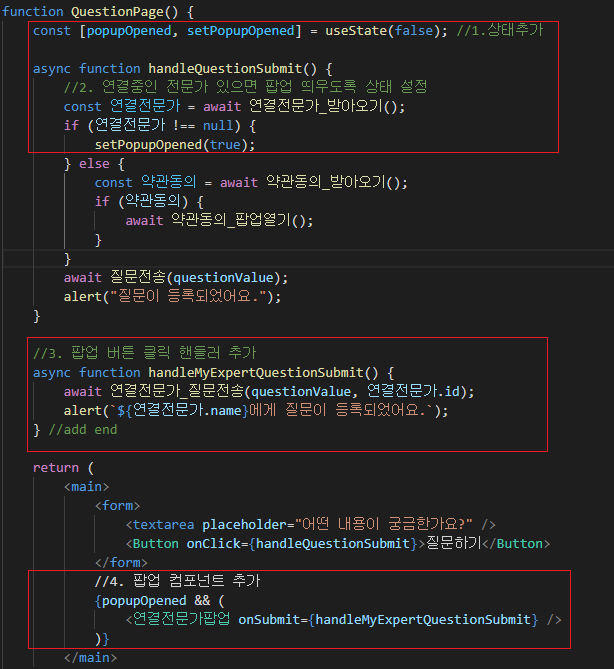
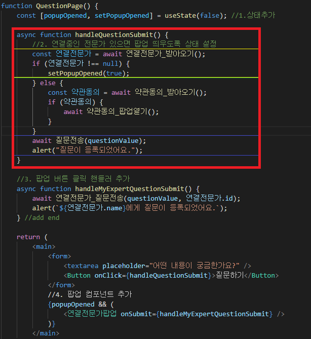

# 리액트 클린코드

###### [toss SLASH21 - 실무에서 바로 쓰는 Frontend Clean Code](https://www.youtube.com/watch?v=edWbHp_k_9Y&t=723s) 를 참고하여 작성

## 클린 코드란?

-   클린코드는 짧은 코드가 아니다.
-   <u>**원하는 로직을 빠르게 찾을수 있는 코드!**</u>

## 원하는 로직을 빠르게 찾으려면?

-   응집도
    > 하나의 목적을 가진 코드가 흩뿌려져 있을 때 응집도를 높여 뭉쳐두어야 한다.
-   단일책임
    > 함수가 여러가지의 일을 하고있을 때 단일책임 원칙에 따라 쪼개주어야 한다.
-   추상화
    > 함수의 세부구현 단계가 제각각일때 추상화 단계를 조절하여 핵심 개념을 필요한 만큼만 노출한다.

## 예제를 통해 알아보자

-   <b>기존 코드</b>

```javascript
function QuestionPage() {
    async function handleQuestionSubmit() {
        const 약관동의 = await 약관동의_받아오기();
        if (약관동의) {
            await 약관동의_팝업열기();
        }
        await 질문전송(questionValue);
        alert("질문이 등록되었어요.");
    }

    return (
        <main>
            <form>
                <textarea placeholder="어떤 내용이 궁금한가요?" />
                <Button onClick={handleQuestionSubmit}>질문하기</Button>
            </form>
        </main>
    );
}
```

-   질문하기 버튼을 클릭하면 유저의 약관동의 여부를 확인하고 필요시 팝업을 띄운다.
-   질문을 전송하고 성공시 alert을 띄우는 간단한 로직이다.

이 코드에 새로운 기능추가 요건이 들어왔다고 가정해보자. 요건은 다음과 같다.

> **질문하기** 버튼을 눌렀을 때 연결중인 전문가가 있다면,  
> 그 정보를 보여주고 그 전문가에게 물어볼 수 있는 기능을 추가해주세요~

과연 어떻게 할것인가 ?

1. 버튼 클릭함수에서 연결중인 전문가가 있는지 확인하는 코드를 넣고 state 설정
2. return에는 state 조건에 따라 팝업 컴포넌트를 보여준다!
3. 팝업 관련 핸들러 및 컴포넌트 추가

이렇게 할거같다.

-   <b>수정 코드</b>

```javascript
function QuestionPage() {
    const [popupOpened, setPopupOpened] = useState(false); //1.상태추가

    async function handleQuestionSubmit() {
        //2. 연결중인 전문가 있으면 팝업 띄우도록 상태 설정
        const 연결전문가 = await 연결전문가_받아오기();
        if (연결전문가 !== null) {
            setPopupOpened(true);
        } else {
            const 약관동의 = await 약관동의_받아오기();
            if (약관동의) {
                await 약관동의_팝업열기();
            }
        }
        await 질문전송(questionValue);
        alert("질문이 등록되었어요.");
    }

    //3. 팝업 버튼 클릭 핸들러 추가
    async function handleMyExpertQuestionSubmit() {
        await 연결전문가_질문전송(questionValue, 연결전문가.id);
        alert(`${연결전문가.name}에게 질문이 등록되었어요.`);
    } //add end

    return (
        <main>
            <form>
                <textarea placeholder="어떤 내용이 궁금한가요?" />
                <Button onClick={handleQuestionSubmit}>질문하기</Button>
            </form>
            //4. 팝업 컴포넌트 추가
            {popupOpened && (
                <연결전문가팝업 onSubmit={handleMyExpertQuestionSubmit} />
            )}
        </main>
    );
}
```

## 기능은 잘 동작하는데... 나쁜 코드가 되었다

-   이유는?

    > 1.하나의 목적을 위한 코드가 흩뿌려져 있다.

    표시한 코드가 모두 '연결 중인 전문가 팝업 관련 코드인데, 하나의 목적을 위한 코드가 흩뿌려져있다.

    

    > 2.하나의 함수가 여러 가지 일을 하고있다.

    기존에 있던 함수가 아래 3가지의 일을 하고있다.
    세부 구현을 모두 읽어야만 함수의 역할을 파악할 수 있는 문제가 있다.

    -   연결전문가 받아오기
    -   약관동의 받아오기
    -   질문전송

    

    > 3.함수의 세부 구현단계가 제각각이다.

    -   handleQuestionSubmit()
    -   handleMyExpertQuestionSubmit()

    이 두 함수는 모두 이벤트 핸들링 관련 함수이나, handleQuestionSubmit은 3가지의 일을 담당하고있다.

## 기능을 추가하면서 엉망이 되었다.. 리팩토링 해보자

-   <b>리팩토링 코드</b>

```javascript
function QuestionPage() {
    const 연결전문가 = useFetch(연결전문가_받아오기);

    //1. 함수의 세부 구현단계 일치시키기
    async function handleNewExpertQuestionSubmit() {
        await 질문전송(questionValue);
        alert("질문이 등록되었어요.");
    }

    async function handleMyExpertQuestionSubmit() {
        await 연결전문가_질문전송(questionValue, 연결전문가.id);
        alert(`${연결전문가.name}에게 질문이 등록되었어요.`);
    }

    return (
        <main>
            <form>
                <textarea placeholder="어떤 내용이 궁금한가요?" />
            </form>
            <!--
            2. 하나의 목적인 코드 뭉치기
            기존에는 팝업을 여는 버튼과 팝업 코드가 떨어져 있었는데, 이를 하나로
            -->
            {연결전문가.connected ? (
                <PopupTriggerButton
                    popup={
                        <연결전문가팝업
                            onSubmit={handleMyExpertQuestionSubmit}
                        />
                    }
                >
                    질문하기
                </PopupTriggerButton>
            ) : (
               <Button onClick={async() => {
                   await openPopupToNotAgreedUsers();
                   await handleMyExpertQuestionSubmit();
               }}>질문하기</Button>
            )}
        </main>
    );
}

// 3. 함수 하나에서 하나의 일만 하도록 쪼개기
async function openPopupToNotAgreedUsers() {
    const 약관동의 = await 약관동의_받아오기();
        if (약관동의) {
            await 약관동의_팝업열기();
        }
}
```

[내용 추가 중]

코드가 이전보다 길어졌지만 원하는 로직을 빠르게 찾을 수 있다.  
이는 앞서 살펴본 응집도/단일책임/추상화 측면에서 리팩토링을 진행한 결과이다.

# 정리

## 클린코드는 짧은 코드가 아닌

-   코드 파악/디버깅/리뷰 측면에서 유지보수 시간을 단축 시킬 수 있도록 하는 깔끔한 코드를 의미한다.
-   이를 위해 응집도/단일책임/추상화를 고려하여 코드를 작성해야한다.
