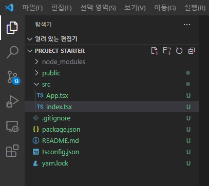

# 1장. 프로젝트 생성 및 설정

## 1. typescript 설정으로 react-app을 만든다.

```
yarn create react-app project-starter --template typescript
cd project-starter
yarn
yarn start
```

## 2. App.tsx와 index.tsx를 제외한 불필요한 코드를 지워준다.

### App.tsx

코드를 모두 지우고 snippets의 rsc를 통해 컴포넌트를 만든다.

```tsx
import React from "react";

const App = () => {
    return <div>hello starter</div>;
};

export default App;
```

### index.tsx

```tsx
import React from "react";
import ReactDOM from "react-dom";
import App from "./App";

ReactDOM.render(
    <React.StrictMode>
        <App />
    </React.StrictMode>,
    document.getElementById("root")
);
```

```
yarn
yarn start
```

## 3. 실행결과 확인


## 4. 폴더구조 확인



---

<b>Github Link : [react-typescript-project-starter](https://github.com/seungjae-yu/react-typescript-project-starter)</b>

---
