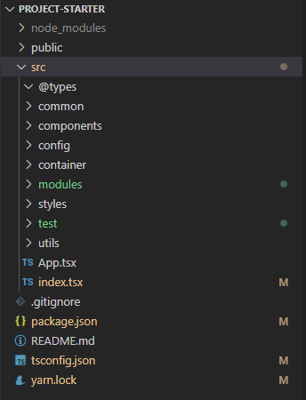

# 2장. 프로젝트 설정

프로젝트 설정 및 진행에 필요한 패키지 및 vscode extension을 설치한다.

## 1. ignore 파일 설정

https://www.toptal.com/developers/gitignore 을 사용하여 만든다.  
.gitignore

```
# Created by https://www.toptal.com/developers/gitignore/api/react
# Edit at https://www.toptal.com/developers/gitignore?templates=react

### react ###
.DS_*
*.log
logs
**/*.backup.*
**/*.back.*

node_modules
bower_components

*.sublime*

psd
thumb
sketch

# End of https://www.toptal.com/developers/gitignore/api/react
```

## 2. 패키지 설치

-   typescript
-   redux
-   jest
-   immer (or immutable)
-   material ui (필요에 따라)
-   styled component (필요에 따라)

```
yarn add -D typescript
yarn add redux react-redux
yarn add -D @types/react-redux
yarn add -D jest ts-jest @types/jest
yarn add immer
yarn add material-ui @material-ui/core @material-ui/icons @material-ui/data-grid @material-ui/lab
yarn add -D @types/material-ui
yarn add styled-components
yarn add -D @types/styled-components
```

## 3. vscode extension 설치

-   Reactjs code snippets
-   ESLint (TSLint)
-   Auto Import
-   Prettier - Code Formatter
-   Git Graph
-   Jest / Jest Runner
-   Paste JSON as Code
-   vscode-styled-components

## 4. 폴더구조 설정



-   @types : interface, type등 type관련 정보
-   common : 공통으로 재사용하는 component
-   components : 페이지 구성에 사용되는 각 컴포넌트
-   config : 개발에 사용하는 설정정보 (ex: DB or network config json)
-   container : component를 묶어 구성한 영역. dispatch 수행하는 함수를 하위 component에 props로 전달
-   modules : redux, redux-saga의 state 정보
-   styles : styledComponent, css 등 ui 관련 코드
-   test : jest를 통한 test 코드
-   utils : utility 코드

---

<b>Github Link : [react-typescript-project-starter](https://github.com/seungjae-yu/react-typescript-project-starter)</b>

---
