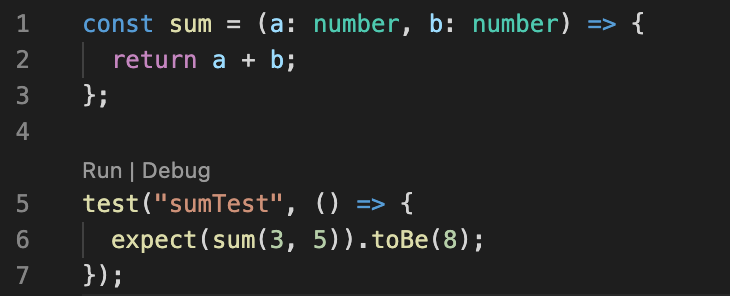
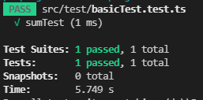

# 3장. Jest + TypeScript 테스트 환경 설정

## 1. Jest config 설정

/src/test 하위에 jest.config.js 파일을 생성한다.

```js
module.exports = {
    testMatch: [
        "**/__tests__/**/*.+(ts|tsx|js)",
        "**/?(*.)+(spec|test).+(ts|tsx|js)",
    ],
    transform: {
        "^.+\\.(ts|tsx)$": "ts-jest",
    },
};
```

## 2. Test 코드 추가

Jest가 정상 동작하는지 확인하기위한 테스트코드를 작성해본다.
/src/test/basicTest.test.ts

```js
const sum = (a: number, b: number) => {
    return a + b;
};

test("sumTest", () => {
    expect(sum(3, 5)).toBe(8);
});

//ADD Your TestCode
//
```

## 3. isolatedModule 오류 해결 및 exclude

--isolatedModules 문제가 발생한다.  
tsconfig.json에 isolatedModules 옵션을 false로 바꿔준다.  
그리고 test코드를 exclude 해준다.

```json
{
    "compilerOptions": {
        "target": "es5",
        "lib": ["dom", "dom.iterable", "esnext"],
        "allowJs": true,
        "skipLibCheck": true,
        "esModuleInterop": true,
        "allowSyntheticDefaultImports": true,
        "strict": true,
        "forceConsistentCasingInFileNames": true,
        "noFallthroughCasesInSwitch": true,
        "module": "esnext",
        "moduleResolution": "node",
        "resolveJsonModule": true,
        "isolatedModules": false,
        "noEmit": true,
        "jsx": "react-jsx"
    },
    "include": ["src"],
    "exclude": ["src/test"]
}
```

## 4. [Jest](https://marketplace.visualstudio.com/items?itemName=Orta.vscode-jest) , [Jest Runner](https://marketplace.visualstudio.com/items?itemName=firsttris.vscode-jest-runner) 플러그인 설치

플러그인 설치시 함수 바로위에 RUN | DEBUG 버튼이 생기고, 눌러서 바로 실행시킬 수 있다.


Jest가 정상적으로 동작하는지 확인한다.  


---

<b>Github Link : [react-typescript-project-starter](https://github.com/seungjae-yu/react-typescript-project-starter)</b>

---
