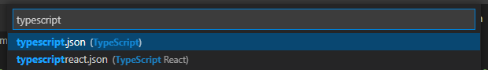

# 4장. redux 및 snippet 적용하기

## 1. sampleReducer 생성

자주 사용하는 ducks패턴을 적용한 redux reducer 형식을  
snippets로 등록하기 위한 sampleReducer를 만든다.  
/src/modules/sampleReducer.ts

```typescript
import produce from "immer";

// 1. Action Type
const LOAD_DATA = "sample/LOAD_DATA";
const ADD_DATA = "sample/ADD_DATA"; //or add

// 2. Action Creator
// change type any to your data Type
export const LoadDataAction = (data: any) => ({
    type: LOAD_DATA,
    payload: data,
});
export const AddDataAction = (data: any) => ({ type: ADD_DATA, payload: data });

// 3. return types
export type sampleActions =
    | ReturnType<typeof LoadDataAction>
    | ReturnType<typeof AddDataAction>;

// 4. State type
export interface sampleState {
    data: any; //any to your data Type
}

// 5. initial State
const initialState: sampleState = {
    data: "",
};

// 6. reducer
const sampleReducer = (
    state: sampleState = initialState,
    action: sampleActions
): sampleState => {
    switch (action.type) {
        case LOAD_DATA: {
            return produce(state, (draft) => {});
        }
        case ADD_DATA: {
            return produce(state, (draft) => {});
        }
        default: {
            return produce(state, (draft) => {});
        }
    }
};

export default sampleReducer;
```

## 2. redux reducer snippet 만들기

위 코드를 snippet generator에 넣고 "sample"이란 단어를 모두 ${TM_FILENAME_BASE}로 바꿔준다.  
[snippet generator](https://snippet-generator.app)

```ts
import produce from 'immer';

// 1. Action Type
const LOAD_DATA = '${TM_FILENAME_BASE}/LOAD_DATA';
const ADD_DATA = '${TM_FILENAME_BASE}/ADD_DATA';

// 2. Action Creator
// change type any to your data Type
export const LoadDataAction = (data: any) => ({ type: LOAD_DATA, payload: data });
export const AddDataAction = (data: any) => ({ type: ADD_DATA, payload: data });

// 3. return types
export type ${TM_FILENAME_BASE}Actions = ReturnType<typeof LoadDataAction> | ReturnType<typeof AddDataAction>;

// 4. State type
export interface ${TM_FILENAME_BASE}State {
    data: any;  //any to your data Type
}

// 5. initial State
const initialState: ${TM_FILENAME_BASE}State = {
    data: ""
};

// 6. reducer
const ${TM_FILENAME_BASE}Reducer = (state: ${TM_FILENAME_BASE}State = initialState, action: ${TM_FILENAME_BASE}Actions): ${TM_FILENAME_BASE}State => {
    switch (action.type) {
        case LOAD_DATA: {
            return produce(state, draft => { })
        }
        case ADD_DATA: {
            return produce(state, draft => { })
        }
        default: {
            return produce(state, draft => { })
        }
    }
}

export default ${TM_FILENAME_BASE}Reducer;
```

<b>Description</b>에는 <b>snippet 이름</b>을, <b>Tab Trigger</b>에는 <b>사용할 snippet 단축이름</b>을 입력한다.  
본인은 <b>ReduxReducerDucks</b>와 <b>rrd</b>를 입력했다.

생성된 snippet 정보는 다음과 같다.

```json
"ReduxReducerDucks": {
  "prefix": "rrd",
  "body": [
    "import produce from 'immer';",
    "",
    "// 1. Action Type",
    "const LOAD_DATA = '${TM_FILENAME_BASE}/LOAD_DATA';",
    "const ADD_DATA = '${TM_FILENAME_BASE}/ADD_DATA';",
    "",
    "// 2. Action Creator",
    "// change type any to your data Type",
    "export const LoadDataAction = (data: any) => ({ type: LOAD_DATA, payload: data });",
    "export const AddDataAction = (data: any) => ({ type: ADD_DATA, payload: data });",
    "",
    "// 3. return types",
    "export type ${TM_FILENAME_BASE}Actions = ReturnType<typeof LoadDataAction> | ReturnType<typeof AddDataAction>;",
    "",
    "// 4. State type",
    "export interface ${TM_FILENAME_BASE}State {",
    "    data: any;  //any to your data Type",
    "}",
    "",
    "// 5. initial State",
    "const initialState: ${TM_FILENAME_BASE}State = {",
    "    data: \"\"",
    "};",
    "",
    "// 6. reducer",
    "const ${TM_FILENAME_BASE}Reducer = (state: ${TM_FILENAME_BASE}State = initialState, action: ${TM_FILENAME_BASE}Actions): ${TM_FILENAME_BASE}State => {",
    "    switch (action.type) {",
    "        case LOAD_DATA: {",
    "            return produce(state, draft => { })",
    "        }",
    "        case ADD_DATA: {",
    "            return produce(state, draft => { })",
    "        }",
    "        default: {",
    "            return produce(state, draft => { })",
    "        }",
    "    }",
    "}",
    "",
    "export default ${TM_FILENAME_BASE}Reducer;"
  ],
  "description": "ReduxReducerDucks"
}
```

## 3. vscode에 snippet 등록

-   파일 > 기본설정 > 사용자 코드조각 > typescript 선택하고 위의 snippet json을 붙여넣는다.

    

-   test.ts 파일을 생성하고  
    snippet key로 설정한 <b>rrd</b>를 입력하여 redux reducer 자동완성이 잘 되는지 확인한다.  
     

-   파일이름인 test를 갖는 ducks 패턴이 적용된 redux reducer가 바로 생성되었다.

    

## 4. redux rootReducer 생성

/src/modules 하위에 index.ts 파일을 생성한다.  
생성후에 위에서 sample로 만든 reducer를 추가한다.

```ts
import sampleReducer, { sampleState } from "./sampleReducer";
import { combineReducers } from "redux";

export interface StoreState {
    //reducer 추가시 아래 형태로 추가
    //reducer : reducerState
    sampleReducer: sampleState;
}

const rootReducer = combineReducers<StoreState>({
    //interface에 추가한 reducer 설정
    sampleReducer,
});

export default rootReducer;
export type RootState = ReturnType<typeof rootReducer>;
```

## 5. rootReducer 등록

/src/index.tsx에 rootReducer를 createStore를 통해 store를 만들고 provider에 등록한다.

index.tsx

```tsx
import React from "react";
import ReactDOM from "react-dom";
import { Provider } from "react-redux";
import { createStore } from "redux";
import App from "./App";
import rootReducer from "./modules";

const store = createStore(rootReducer);

ReactDOM.render(
    <React.StrictMode>
        <Provider store={store}>
            <App />
        </Provider>
    </React.StrictMode>,
    document.getElementById("root")
);
```

redux와 redux reducer snippets 적용까지 끝냈다.

---

<b>Github Link : [react-typescript-project-starter](https://github.com/seungjae-yu/react-typescript-project-starter)</b>

---
