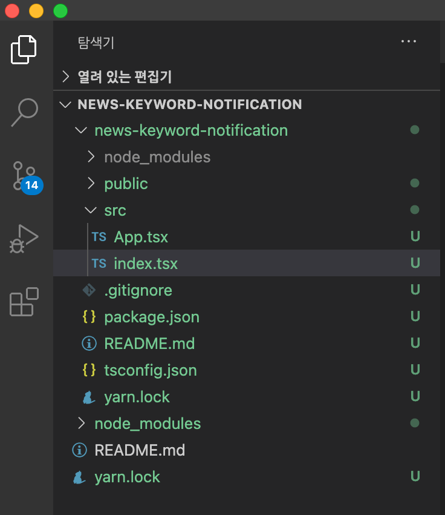

# 1장. 프로젝트 생성

## 1. typescript 설정으로 react-app을 만든다.

```
yarn create react-app news-keyword-notification --template typescript
cd news-keyword-notification
yarn
yarn start
```

## 2. 불필요한 코드를 지워준다.

### App.tsx

```tsx
import React from "react";

const App = () => {
  return <div>hello world</div>;
};

export default App;
```

### index.tsx

```tsx
import React from "react";
import ReactDOM from "react-dom";
import App from "./App";

ReactDOM.render(
  <React.StrictMode>
    <App />
  </React.StrictMode>,
  document.getElementById("root")
);
```

```
yarn
yarn start
```

## 3. 실행결과 확인


# 4. 폴더구조 참고


