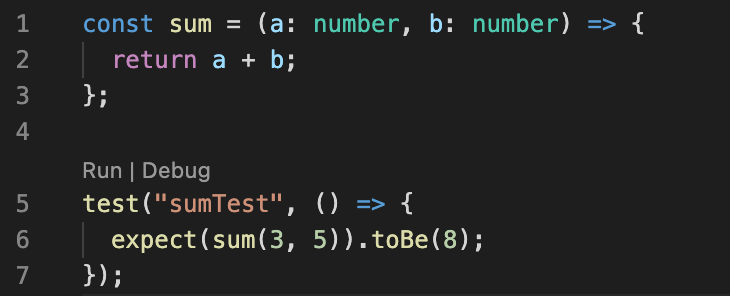

# Jest + TypeScript 환경설정하기

## 모듈 설치

```
yarn add jest @types/jest ts-jest typescript
```

## Jest config 설정

```js
module.exports = {
  testMatch: [
    "**/__tests__/**/*.+(ts|tsx|js)",
    "**/?(*.)+(spec|test).+(ts|tsx|js)",
  ],
  transform: {
    "^.+\\.(ts|tsx)$": "ts-jest",
  },
};
```

## vs code 플러그인 설치

테스트 코드를 작성하고 vscode에서 바로 돌려볼 수 있는 매우 편리한 플러그인이다.

1. [Jest](https://marketplace.visualstudio.com/items?itemName=Orta.vscode-jest)

2. [Jest Runner](https://marketplace.visualstudio.com/items?itemName=firsttris.vscode-jest-runner)

## test 코드 작성

테스트코드는 \*.test.ts 로 만든다.
위의 플러그인 설치시 함수 바로위에 RUN | DEBUG 버튼이 생기고, 눌러서 바로 실행시킬 수 있다.


## isolatedModule 오류 해결

혹시 --isolatedModules ~ 관련 오류가 나타난다면 tsconfig.json에 해당옵션을 false로 바꿔준다.

```
"isolatedModules": false,
```
