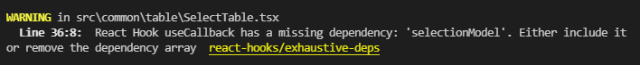

# eslintConfig

## eslint 설정

package.json에 아래 설정을 적어주면 lint 검사를 할 수 있다.

```json
"eslintConfig": {
        "extends": [
            "react-app",
            "react-app/jest"
        ],
}
```

기본적인 lint 뿐만 아니라  
react hook에서 dependency 누락을 알려주는 기능도 있어 편리하다.

